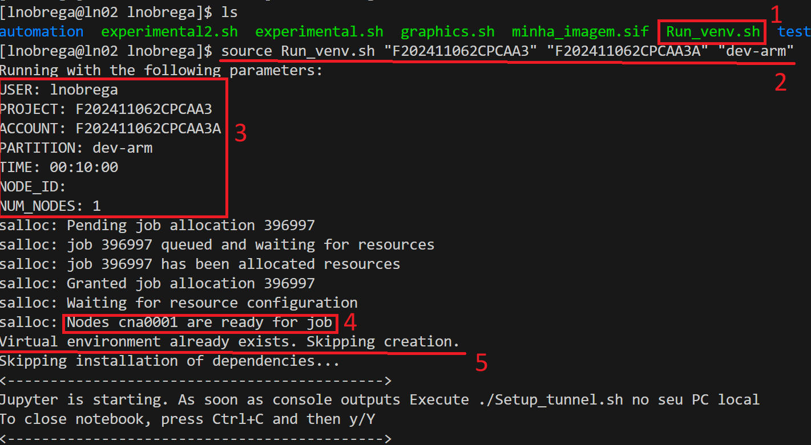
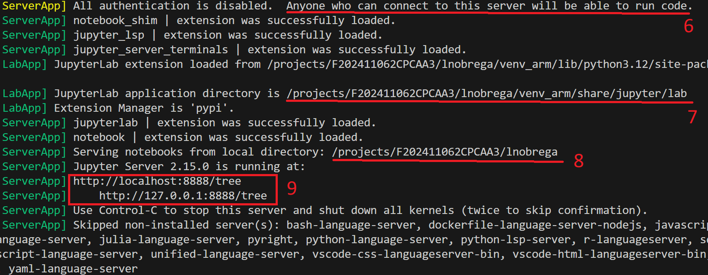
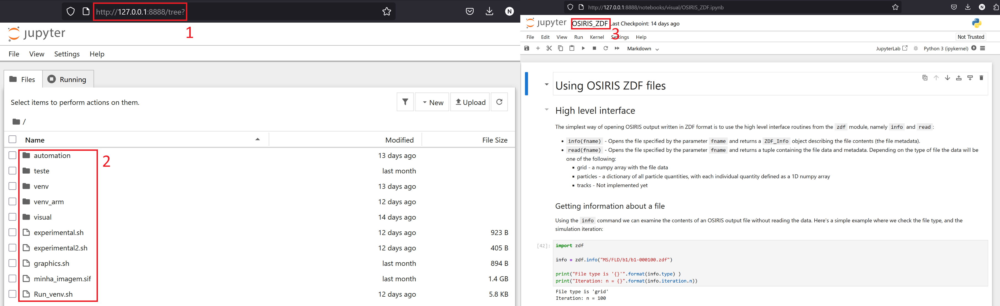

# Jupyter Visualization User Guide
**Author**: Luís Nóbrega  
📧 luis.nobrega@tecnico.ulisboa.pt

---

## Table of Contents

- [Introduction](#introduction)
- [1. Prerequisites](#1-prerequisites)
- [2. Setting up Run_venv.sh](#2-setting-up-run_venvsh)
- [3. Setting up Tunnel_venv.sh](#3-setting-up-tunnel_venvsh)
- [4. Quick Start Guide](#4-quick-start-guide)
- [5. Script Overviews](#5-script-overviews)
  - [5.1 Run_venv.sh](#51-run_venvsh)
  - [5.2 Tunnel_venv.sh](#52-tunnel_venvsh)
- [Support & Contact](#support--contact)

---

## Introduction

Welcome to Jupyter Visualization User Guide. This tool is useful if you use python based visualization tools on HPC environments. This document walks you through everything you need to get started with Jupyter from an allocated node inside an HPC cluster. By the end of this guide, you'll know how to start the server and run Jupyter cells through a browser. 

---

## 1. Prerequisites

Before you begin, ensure the following:

1. **GUI can be forwarded to HPC**  
   - Make sure your HPC environment accepts connections from your local PC. Your HPC environment should also support virtual environments (`venv`). If unsure, consult your admin.

2. **Transfer the needed files**  
   - You need two files: `Run_venv.sh` (on HPC cluster) and `Tunnel_venv.sh` (on local machine)
   - Make them executable with `chmod +x file_name`

---

## 2. Setting up Run_venv.sh 

1. **Script function**  
   Creates a virtual environment with Jupyter dependencies and starts a Jupyter server. First run is slow (environment setup), subsequent runs are faster.

2. **Setup base parameters**  
   Edit these defaults in the script:
   ```shell
   # <--------------------- DEFAULT ARGUMENTS --------------------->
   USER_DEFAULT=$USER
   PROJECT_DEFAULT=""  # e.g., F202411062CPCAA3
   ACCOUNT_DEFAULT=""  # e.g., F202411062CPCAA3A
   PARTITION_DEFAULT=""  # e.g., dev-arm
   TIME_DEFAULT="00:10:00"
   NODE_ID_DEFAULT=""  # e.g., cna0001
   NUM_NODES_DEFAULT="1"
   INSTALL_DEFAULT="1"  # 1 = True, 0 = False
   VENV_NAME_DEFAULT="venv_arm"
   # <--------------------- END OF USER SETUP ZONE --------------------->
   ```
   -  PROJECT_DEFAULT, ACCOUNT_DEFAULT, PARTITION_DEFAULT must be set
   -  Use HPC documentation for valid partition names

3. Executing the script
```shell
source Run_venv.sh [PROJECT] [ACCOUNT] [PARTITION] [TIME] [INSTALL] [NODE_ID] [NUM_NODES] [VENV_NAME]
```

Example execution:




## 3. Setting up Tunnel_venv.sh

1. Script function

Creates SSH tunnel from local machine → login node → allocated node. Best used with VSCode.

2. Setup base parameters

Edit these defaults in the script:

```shell
# <--------------------- DEFAULT ARGUMENTS --------------------->
USER_DEFAULT=""  # e.g., lnobrega
LOGIN_DEFAULT=""  # e.g., login.deucalion.macc.fccn.pt
NODE_DEFAULT=""  # e.g., cna0001
PORT_DEFAULT="8888" 
SEC_PORT_DEFAULT="8889"
# <--------------------- END OF USER SETUP ZONE --------------------->
```

3. Executing the script

```shell
source Tunnel_venv.sh [USER] [LOGIN] [NODE] [PORT]
```

After execution, access Jupyter at `http://localhost:8888/`(paste the link in a local browser):


## 4. Quick Start Guide

1. Prepare scripts

    - Set parameters in both scripts (see sections 2 and 3)

    - Place Run_venv.sh on HPC cluster

    - Place Tunnel_venv.sh on local machine

2. Allocate node and start Jupyter

```shell
# On HPC cluster:
source Run_venv.sh [PROJECT] [ACCOUNT] [PARTITION]
```

Note allocated node ID (e.g., `cna0001`)

3. Create SSH tunnel

```shell
# On local machine:
source Tunnel_venv.sh [USER] [LOGIN] [NODE]
```

4. Access Jupyter

    Open browser to `http://localhost:8888/`

    Use the virtual environment kernel named `jupyter_arm`

## 5. Script Overviews

## 5.1 Run_venv.sh

```shell
#!/bin/bash

# This software was created by lnobrega @ GOLP

# <--------------------- DEFAULT ARGUMENTS --------------------->

USER_DEFAULT=$USER
PROJECT_DEFAULT="" #F202411062CPCAA3
ACCOUNT_DEFAULT="" #F202411062CPCAA3A
PARTITION_DEFAULT="" #dev-arm
TIME_DEFAULT="00:10:00"
NODE_ID_DEFAULT="" #cna0001
NUM_NODES_DEFAULT="1"
INSTALL_DEFAULT="1" # 1 = True, 0 = False
VENV_NAME_DEFAULT="venv_arm" # Name of the virtual environment

# <--------------------- END OF USER SETUP ZONE --------------------->

# <--------------------- FUNCTION DEFINITIONS --------------------->

# Ensure the script is sourced, and not executed in any other way
if [[ "${BASH_SOURCE[0]}" == "${0}" ]]; then
    echo "ERROR: This script must be sourced. Run it with: source [OPTION1] [OPTION2] $(basename "$0")"
    return 1
fi

# Assign arguments or defaults
PROJECT="${1:-$PROJECT_DEFAULT}"
ACCOUNT="${2:-$ACCOUNT_DEFAULT}"
PARTITION="${3:-$PARTITION_DEFAULT}"
TIME="${4:-$TIME_DEFAULT}"
INSTALL="${5:-$INSTALL_DEFAULT}"
VENV_NAME="${6:-$VENV_NAME_DEFAULT}"
NODE_ID="${7:-$NODE_ID_DEFAULT}"
NUM_NODES="${8:-$NUM_NODES_DEFAULT}"

# Function to print helpfun information
usage() {
    echo "WARNING: This should be executed in the directory where your files are/will be stored or that contains the correct subdirectories."
    echo "<-------------------------------------------->"
    echo "Usage: source $0 [PROJECT] [ACCOUNT] [PARTITION] [TIME] [INSTALL] [NODE_ID] [NUM_NODES] [VENV_NAME]"
    echo "Reminder: If you want to pass an argument, you must pass all the previous ones. If you want to skip an argument, pass an empty string." 
    echo "<-------------------------------------------->"
    echo "Required arguments: PROJECT, ACCOUNT, PARTITION"
    echo "Optional arguments: TIME (default: $TIME_DEFAULT), INSTALL(default: $INSTALL_DEFAULT), \
    NUM_NODES (default: $NUM_NODES_DEFAULT), NODE_ID (default: First available inside PARTITION) \
    VENV_NAME (default: $VENV_NAME_DEFAULT)"
    echo "<-------------------------------------------->"
    echo "WARNING: Will be using USER as $USER. IF that is not the case, please change the script."
    echo "<-------------------------------------------->"
    return 1
}

# Check for invalid arguments
if [[ ! -z "$NODE_ID" && $NUM_NODES != "1" ]]; then
    echo "ERROR: NODE_ID can only be used when requesting a single node and you requested $NUM_NODES nodes."
    echo "<-------------------------------------------->"
    return 1
fi

# Check for required arguments
if [[ -z "${USER_DEFAULT// }" || -z "${PROJECT// }" || -z "${ACCOUNT// }" || -z "${PARTITION// }" ]]; then
    echo "ERROR: Missing required arguments!"
    echo "<-------------------------------------------->"
    usage
    return 1
fi

if [[ $INSTALL != "0" && $INSTALL != "1" ]]; then
    echo "ERROR: INSTALL must be 0 or 1. You used $INSTALL."
    echo "<-------------------------------------------->"
    return 1
fi

CURRENT=$(pwd)

# Inform user about parameters in use
echo "Running with the following parameters:"
echo "USER: $USER_DEFAULT"
echo "PROJECT: $PROJECT"
echo "ACCOUNT: $ACCOUNT"
echo "PARTITION: $PARTITION"
echo "TIME: $TIME"
echo "NODE_ID: $NODE_ID"
echo "NUM_NODES: $NUM_NODES"


SALLOC_CMD="salloc --nodes=$NUM_NODES --partition=$PARTITION -t $TIME --account=$ACCOUNT"

# Add the speciic 
if [[ ! -z "$NODE_ID" ]]; then
    SALLOC_CMD+=" --nodelist=$NODE_ID"
fi

# <--------------------- ACTIVATE ENVIRONMENT --------------------->

$SALLOC_CMD bash -c "
  set -e  # Exit if any command fails

  echo '#####################################################################'
  echo ''
  echo 'Use the node id information above to setup the tunnel on your local machine after jupyter starts.'
  echo ''
  echo '#####################################################################'

  module load Python || { echo 'Failed to load Python module'; exit 1; }
  

  # Check if virtual environment exists
  if [[ ! -d '/projects/$PROJECT/$USER_DEFAULT/$VENV_NAME' && '$INSTALL' == '0' ]]; then
      echo 'ERROR: Virtual environment does not exist. Please run this script with INSTALL=1.'
      echo '<-------------------------------------------->'
      return 1
  elif [[ ! -d '/projects/$PROJECT/$USER_DEFAULT/$VENV_NAME' && '$INSTALL' == '1' ]]; then
      echo 'Instaling virtual environment...'
      echo '<-------------------------------------------->'
      python3 -m venv /projects/'$PROJECT'/'$USER_DEFAULT'/$VENV_NAME
  else
      echo 'Virtual environment already exists. Skipping creation.'
  fi

  # Activate venv and install dependencies
  source /projects/'$PROJECT'/'$USER_DEFAULT'/$VENV_NAME/bin/activate
  
  if [ $INSTALL == '1' ]; then
        echo 'Installing/updating dependencies...'
        echo '<-------------------------------------------->'
        echo 'Jupyter is starting. As soon as console outputs Execute ./Setup_tunnel.sh no seu PC local'
        echo 'To close notebook, press Ctrl+C and then y/Y'
        echo '<-------------------------------------------->'
        pip3 install --upgrade pip
        pip3 install --upgrade jupyter numpy matplotlib ipykernel
        python -m ipykernel install --user --name=jupyter_arm --display-name 'jupyter_arm'
  else
        echo 'Skipping installation of dependencies...'
        echo '<-------------------------------------------->'
        echo 'Jupyter is starting. As soon as console outputs Execute ./Setup_tunnel.sh no seu PC local'
        echo 'To close notebook, press Ctrl+C and then y/Y'
        echo '<-------------------------------------------->'     
  fi

  # Start Jupyter notebook
  jupyter notebook --no-browser --port=8888 --NotebookApp.token="" --NotebookApp.allow_origin='*'
"
# To run the notebook with a user password for security change the line above to:
# jupyter notebook --no-browser --port=8888 --NotebookApp.password='sha1:yourhashedpassword' --NotebookApp.allow_origin='*'

```


## 5.2 Tunnel_venv.sh

```shell
#!/bin/bash

# This software was created by lnobrega @ GOLP

# <--------------------- DEFAULT ARGUMENTS --------------------->

USER_DEFAULT="" #lnobrega
LOGIN_DEFAULT="" #login.deucalion.macc.fccn.pt
NODE_DEFAULT="" #cna0001
PORT_DEFAULT="8888" 
SEC_PORT_DEFAULT="8889" # Usually port 8888 can be blocked

# <--------------------- END OF USER SETUP ZONE --------------------->

USER="${1:-$USER_DEFAULT}"
LOGIN="${2:-$LOGIN_DEFAULT}"
NODE="${3:-$NODE_DEFAULT}"
PORT="${4:-$PORT_DEFAULT}"

usage() {
    echo "WARNING: You must have a valid ssh setup to your server to use this script"
    echo "<-------------------------------------------->"
    echo "Usage: source $0 [USER] [LOGIN] [NODE] [PORT]" 
    echo "Required arguments: USER, LOGIN, NODE"
    echo "Optional arguments: PORT (default: $PORT_DEFAULT)"
    echo "<-------------------------------------------->"
    return 1
}

# Check for invalid arguments
if [[ -z "$USER" || -z $LOGIN || -z $NODE ]]; then
    echo "ERROR: Missing arguments. Please provide the USER, LOGIN and NODE."
    usage
    echo "<-------------------------------------------->"
    return 1
fi

# Set connection to the server

ssh -L $PORT:localhost:$PORT $USER@$LOGIN bash -c "
    ssh -L $SEC_PORT_DEFAULT:localhost:$PORT "$USER@$NODE"
    "
```

## Support & Contact

For questions, issues, or requests:

📧 Luís Nóbrega
luis.nobrega@tecnico.ulisboa.pt

📧 Thales Silva
thales.silva@tecnico.ulisboa.pt