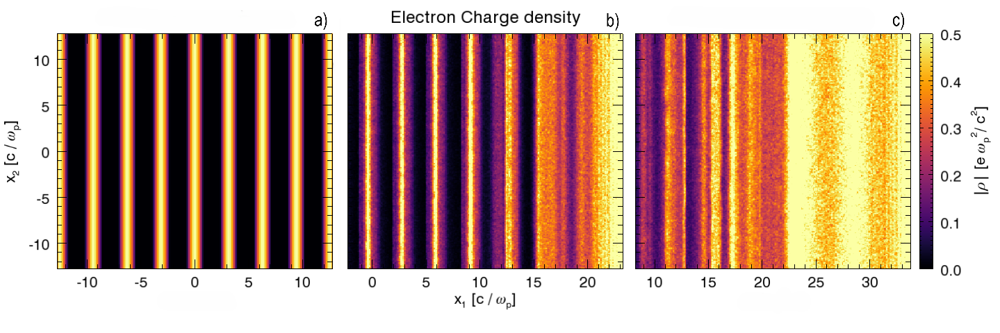

# OSIRIS Steering guide

# User guide

## Introduction

Given the request of some researchers to be able to modify simulation paramethers without depending on restart files and without abdicating of allocated nodes, surged the idea of developing a steering option for OSIRIS. Therefore, a steering module was developed aiming to solve those problems, as well as allow the user a bigger freedom when it comes to secure data, amidst the need to stop a simulation.

The main version of this code (June 2025) is provided publicly here: https://github.com/Luis-Nobrega/OSIRIS_with_Checkpoints and is based on the open source version from 2023.

⚠️ **WARNING:** This project is still experimental and is not yet fitted to deal with every exception. Please try to follow the provided instructions before submitting a file. Bugs, unexpected crashes (or suggestions) should be reported to [luis.nobrega@tecnico.ulisboa.pt](mailto:luis.nobrega@tecnico.ulisboa.pt) and [thales.silva@tecnico.ulisboa.pt](mailto:thales.silva@tecnico.ulisboa.pt).

---

## 1 . Usage

### Disabling the module

By default, the module is activated. To deactivate it, place `DISABLE_STEERING=1` in your config file and reconfigure the code using, for example `./configure -d 2 -s linux.gnu`. 

### Setting the steering frequency

A new variable `steering_step` was defined so as to definethe frequency to which OSIRIS. Setting this variable is MANDATORY, and must be an integer > 0. It has to be manually defined inside the `time_step` block of the `input namelist`.

```fortran
time_step {
  dt     =   0.07,                    ! \Delta t = 0.07
  ndump  =  5,                        ! Global diagnostic frequency set to 5
  steering_step = 50,   
}
```

This frequency is absolute, therefore, in this case, each 50 steps, OSIRIS will allow for modifications to be made. This useful as it allows for more frequent checkpoints with a very reduced tool on simulation efficiency. 

For example, while restart checkpoints could happen at each 1 million steps, this verification could happen at each thousand.

⚠️ **WARNING:** This feature is being fixed so as setting this value is not mandatory and defaulted to 0 -> (04/07/25)

### Steering file

The module will always look for a file named `steering_input_deck` . If successful, this file will be renamed to `steering_input_deck.used` and will no longer be read. The user must then create a new `steering_input_deck` , or modify/rename `steering_input_deck.used` for it to be read again.

The file accepts data in the format: `key = value` . A valid example is as follows:

```fortran
! teste
checkpoint = 1
restart = 1
stop = 0
tmax = 3.5
abort = 0
steering_step = 30

diag_emf_5 = [b1, tavg; ndump_fac; 3]
diag_current_1 = [j1; ndump_fac; 2]
diag_current_2 = [j2; ndump_fac; 3]

```

Blank lines or everything after `!` will be ignored. For good practise, if you need to comment something, do it in the line **above the command**, and **not on the same line**, as that has been reported to ocasionally lead to unexpected behaviour.

---

## 2. Functionalities and list of valid commands

### Basic commands

Basic commands follow the structure `key = value`, where value can be an integer or a real. Always respect the value type to avoid unexpected behaviour. By default, if these values aren’t defined, the commands will be ignored.

| **Key**  | **Description** | **Value**  |
| --- | --- | --- |
| **checkpoint** | Outputs restart files without stopping the simulation | Int → default = 0 ; 1 to activate |
| **steering_step** | Changes the steering step frequency | Int → Must be bigger than 0 ;  |
| **stop** | Outputs restart files and stops the smulation | Int → default = 0 ; 1 to activate |
| **abort** | Stops the simulation WITHOUT outputing restart files | Int → default = 0 ; 1 to activate |
| **tmax** | Changes the maximum simulation time of the simulation. | Real → Must be bigger than current time value or will be ignored |
| **omega_p0** | Changes omega_p0 quantity (not fully tested) | Real → Bigger than 0 |

⚠️ **WARNING:** This feature is being fixed so as values other than `integer` type are accepted. The scripts to process `logical`, `string` and and `double` values are already in place but not implemented yet (04/07/25)

### Diagnostic commands

Diagnostic commands follow the structure :

```fortran
diag_name_n = [part_name; identifier; command; value1; value2; ...]
```

Where:

- **name** → species / neutral / emf / current
- **n** → trash value used to distinguish commands with the same key → see example below
- part_name → Can be any value for emf and current. For species and neutrals, it’s the particle given name. If it has a “+”, it indicates an extra operation that can be performed on that particle
- **identifier** → name of reports ex: https://osiris-code.github.io/osiris/reference/diag_emf
- **command** → bold commands in above link for each diagnostic
- **value1** → The value to assing the command
- **value2** → For multidimentional values such as `n_ave`, use the extra slots

**Important aspects to consider:**

- Suppose you defined “b1” , “b1, savg” , “b1, tavg” etc. As these reports are all connected, preferably, you could submit a series of commands targetet at b1 that would change the ndump_*** of the other parameters as such:

```fortran
diag_emf_1 = [test; b1; ndump_fac; 3]
diag_emf_2 = [test; b1; ndump_fac_ave; 5]
diag_emf_3 = [test; b1; ndump_fac_lineout; 5]
```

- You can overwrite commands.

```fortran
diag_emf_1 = [test; b1; ndump_fac; 3]
! The frequency will be 5 and not 3
diag_emf_1 = [test; b1; ndump_fac; 5] 
```

- To disable a command just set the frequency to 0. Note, however, that certain quantities depend on the same ndump_fac (ex “b1“ and “b1, tavg”) and will be both disabled this way!

```fortran
! Disable b1 and it's dependencies
diag_emf_1 = [test; b1; ndump_fac; 0]
! Disable b1 spacial average quantities
diag_emf_2 = [test; b1; ndump_fac_ave; 0]
```

- To add a diagnostic, just define it’s frequency. Let’s suppose you didn’t define any b1, then, to get the output, you would need to define ndump_fac.

```fortran
! b1 not defined before
diag_emf_1 = [test; b1; ndump_fac; 5]
```

- WARNING: if you want to add new spacial or time averages, YOU MUST define the needed quantities in series, if they weren’t defined prior to that. This inclunes `n_tavg` and `n_ave` This part is still in testing. Try to experiment before using it in an actual long simulation. Also, the module will always detect the grid dimensions, so pay attention to the dimensions you are submitting.
- **NOTE :** adding is not currently supported for **species or particles,** only changing params

```fortran
! Create time average of b1
diag_emf_1 = [test; b1, tavg; ndump_fac; 5]
! Set n_tavg, otherwise code will crash!!!
diag_emf_2 = [test; b1; n_tavg; 5]
! Create space average of b1
diag_emf_3 = [test; b1, savg; ndump_fac_ave; 5]
! Set n_ave, otherwise code will crash!!!
diag_emf_4 = [test; b1;  n_ave; 2; 2]
```

- WARNING 2: When OSIRIS restarts a simulation it reads the namelist again. This means you need to resubmit the steering report comands to have those diagnostics
- WARNING 3: Species has 3 types of reports. One of them is **rep_cell_avg.** To change reports of that type, use the “+” symbol in the name identifier

```fortran
! Changes normal reports
diag_species_1 = [electrons; q1;  ndump_fac; 2]
! Changes averaged reports
diag_species_2 = [electrons+; q1;  ndump_fac; 2]
```

---

## 3. Moving window

A moving window is a simulation technique commonly used in plasma physics and particle-in-cell (PIC) codes where the computational domain moves along with a group of particles or a wave (typically at the speed of light or the group velocity of the laser/plasma structure). This allows for longer effective simulation times with reduced computational cost, as only the relevant region of space is simulated.

There is a feature that allows for changing the background distribution of any species—including those associated with neutrals—on-the-fly during a simulation. This can be useful, for example, to model spatial or temporal variation in plasma profiles.

To use this command, set:

```shell
math_func_expr = [NAME; CMD]
```

Where:

- NAME is the name of the species, such as electrons or positrons2.

- CMD is the custom math function (as a string) that defines the new distribution.

⚠️ Important: This feature only works if your initial distribution was set using a custom math function. Support for switching from predefined profiles (like piecewise) to a custom function dynamically is planned for future versions.

An example that changes a cosine to a flattop distribution is shown bellow:



## 4. Automatic restart

❌ **Failure**: This feature isn't working as of now. Contact support for more info.

Preemptible HPC cluster with QoS-based priority scheduling are High performance computing environments where priority queues dictate who gets to allocate resources and who has to abdicate of theirs in case of reaching operational capacity. 

A **highly experimental** method was developed to cope with the possibility of running orisis in these servers. It consists of running a shell script (preferably in an allocated node)  that will check wether the simulation finished or not and will restart it with the latest checkpoint if canellation was detected.

This script doesn’t account for recurringly crashing simulations (YET) and will keep trying to run it. 

See `Preemptible_HPC_OSIRIS.sh` for more info.

---

# Developer’s Guide

## 1. List of Files

**Core Modules**:

1. `m_workflow_reader.f03`
    - Steering file parser and key-value storage
    - Diagnostic command parsing (`parse_workflow_diagnostic`, `trim_diagnostic`)
    - MPI broadcasting of steering file content
2. `m_workflow.f03`
    - Workflow step management (`check_workflow_step`, `set_workflow_step`)
    - Command execution (`check_and_execute`)
    - Diagnostic handlers (`steering_emf_diag`, `steering_current_diag`, etc.)
    

### **Modified Files** (not provided):

- `main.f03`:
    - Added periodic calls to `check_workflow_step` in the main simulation loop
    - Initialization of `workflow_step` via `set_workflow_step`
- `m_parameters.f03`:
    - Added `DISABLE_STEERING` flag to configure script
- `m_restart.f03`:
    - Linked `write_restart` to steering commands (`checkpoint=1`, `stop=1`)

There are other files where minor modifications were performed. To find them, `cd` into `/source` and use `grep -rn -E ’![*]!’ .`. Every line changed has a `!*!` present for idenfication.

---

## 2. Key Functions

### **Workflow Control**:

- `check_workflow_step(no_co, sim)`:
    - **Frequency**: Triggered every `workflow_step` iterations
    - **Actions**:
        1. Checks for `steering_input_deck` using MPI-aware I/O
        2. Broadcasts file content to all ranks
        3. Renames file to `.used` after successful parsing
        4. Executes commands via `check_and_execute`
- `set_workflow_step(step, sim)`:
    - Sets absolute frequency for steering checks
    - Must be >0 (deactivates if invalid)

### **Command Execution**:

- `check_and_execute(sim)`:
    - Processes commands in priority order:

```fortran
1. checkpoint, restart, stop, abort  ! Simulation control
2. tmax, steering_step              ! Parameter changes
3. diag_*                           ! Diagnostics
```

- Calls specialized routines (e.g., `steering_emf_diag`) for diagnostics

### **Diagnostic Handlers** (Pattern):

```fortran
steering_<TYPE>_diag(sim, report_spec, command, values, ierr)
! TYPE: emf/current/neutral/species
! Actions: Modify ndump_fac, n_ave, n_tavg, etc.
```

- Supports dynamic report creation via `add_<TYPE>_report()`

## **3. Critical Data Structures**

**`m_workflow_reader`**:

```fortran
type term_value_pair
  character(:), allocatable :: term, value
end type

type term_value_collection
  type(term_value_pair), allocatable :: pairs(:)
  integer :: count = 0
end type
```

Stores steering commands as key-value pairs

### **Diagnostic Parsing**:

- `parse_workflow_diagnostic()`:
    
    Deconstructs `[identifier; command; v1; v2; ...]` into:
    
    - `identifier`: e.g., `"b1"`
    - `command`: e.g., `"ndump_fac"`
    - `data`: Array of values

---

## 4. Limitations and Known Bugs

**Critical**:

1. **Neutral/Species Diagnostics**:
    - `steering_neutral_diag` and `steering_species_diag` lack proper initialization
    - Risk of null pointers when accessing `diag%reports`
    - *Workaround*: Pre-declare reports in input deck
2. **Temporal Averaging**:
    - Enabling `n_tavg` at runtime crashes if `tavg_data` is unallocated
    - Fixed for EMF/current, but untested for neutrals
3. **Error Handling**:
    - Most errors only print warnings (no MPI abort)
    - Example: Invalid `tmax` values fail silently
4. Type error 
- Right now a list of strings is converted into a string of integers in `os-workflow.f03` with `str_array_to_int(diag_data, diag_data_int, ierr)` It would be interesting for the parsing to be done individually so as to accept strings, reals and bools
1. Spacial and time averages
- You can add b3, savg and b3 , tavg BUT not b3 , tavg, savg. Altought if pre declared you can change it’s frequency.
1. Didn’t test slice option as I was working with 2D version 
2. For species and neutrals you can’t add a new electron or ion species, just change the possible diagnostics (else it would be an absolute mess)

8 . For neutrals you can’t add new reports, altough you can add spacial and time averages 

1. As of now to update reports they are all initialized, for example, if I declared e1 e2 and b1, and changed b1, e1 and e2 will be reinitialized. For current and emf (neutrals not sure) if seems to not cause problems. For species there are 3 internal structs being one the phasespace. If constantly updating/initializing reports will be a problem you can either 1) Copy the initalization diag functions to a new one that sorts by name 2) If you wanna target uninitialized reports, check if xlabel or other quant of t_diag_report is set. 
2. Species has 3 types of t_vdf_report but I couldn’t find what 
3. IDk why the most recent version has problems with savg ????????????
4. The `valid_report_add` function still hasn’t been correctly implemented 
5. Changing spec distributions with `math_func` is working fine but changing the distribution type has room to fail… 
6. A lot of these changes Don’t properly allocate memory as is done in initialization. Haven’t been an issue yet, but you never know… In case of doubt use high mem nodes, just in case
- **Functional Gaps**:
- **Moving Window**: Not implemented
- **Species Tracking**: `diag_particles` handler is a stub
- **Charge Conservation**: `ndump_fac_charge_cons` disabled by upstream code

---

## 5. Key Implementation Notes

### **MPI Design**:

- **Root Rank (0)**:
    - Reads file (`check_file_exists`)
    - Broadcasts size → content → commands
- **Non-Root Ranks**:
    - Allocate buffers based on broadcasted size
    - Rebuild key-value store locally

### **Dynamic Diagnostics**:

- Adding new reports:

```fortran
call add_emf_report(sim, "e1")  ! Allocates tavg_data if n_tavg>0
```

- Modifications require **full specification**:

```fortran
diag_emf_1 = [e1; ndump_fac; 10]  ! Modifies frequency
diag_emf_2 = [e1; n_tavg; 50]     ! Must be separate command
```

### **Steering File Rules**:

- Last command wins (overwrites earlier duplicates)
- Comments must be on separate lines (no inline `!`)

---

### 6. Future Developmentc

**Priority Fixes**:

1. **Neutral/Species Initialization**:
    - Port EMF-style `tavg_data%new()` to `m_diag_neutral`
    - Validate pointer chains in `diag%reports`
2. **Error Propagation**:
    - Implement `ierr` MPI broadcasting for critical failures

**Enhancements**:

- **Command Chaining**:
    
    Allow `[b1; ndump_fac=5, n_tavg=10]` syntax
    
- **State Rollback**:
    
    Revert parameters if `check_and_execute` fails mid-run
    
- **HPC Integration**:
    
    Expand `Preemptible_HPC_OSIRIS.sh` for automatic restart
    

---

## Summary of Critical Routines

| Function | Module | Purpose |
| --- | --- | --- |
| `read_steering_file` | `m_workflow_reader` | Parse raw file content |
| `check_workflow_step` | `m_workflow` | Core steering trigger |
| `steering_emf_diag` | `m_workflow` | Modify EMF diagnostics |
| `str_array_to_int` | `m_workflow` | Convert `["5","10"]` → `[5,10]` |
| `parse_workflow_diagnostic` | `m_workflow_reader` | Decode `[id; cmd; ...]` |