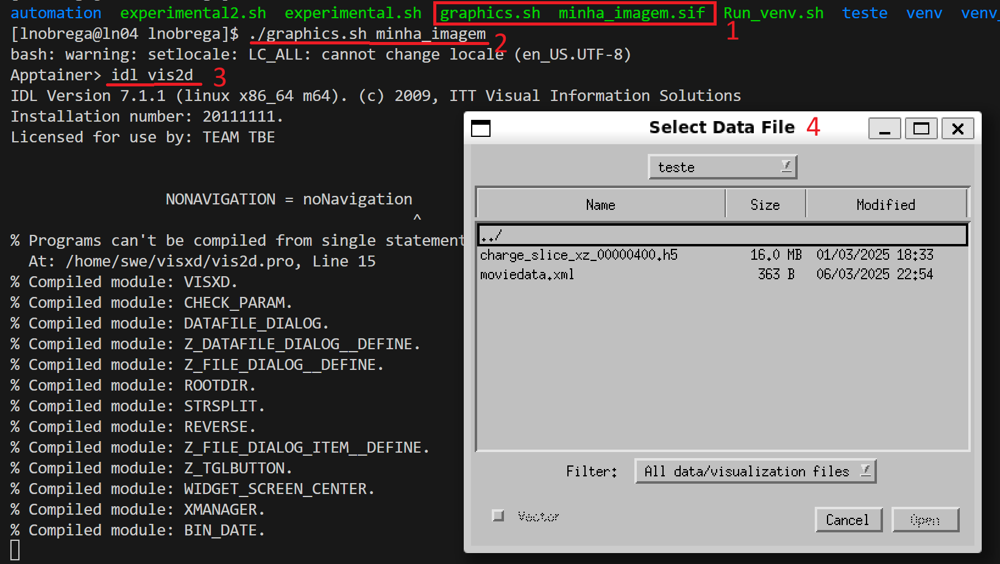

# VisXD Visualization User Guide
**Author**: Luís Nóbrega  
📧 luis.nobrega@tecnico.ulisboa.pt

---

## Table of Contents

- [Introduction](#introduction)
- [1. Prerequisites](#1-prerequisites)
- [2. Requesting and Transferring the Container](#2-requesting-and-transferring-the-container)
- [3. Environment Setup](#3-environment-setup)
  - [3.1 Configuring Your Shell](#31-configuring-your-shell)
- [4. Quick Start Guide](#4-quick-start-guide)
- [5. Script Details: `graphics.sh`](#5-script-details-graphicssh)
- [6. Detailed Container Information](#6-detailed-container-information)
  - [6.1 Building the Singularity Image](#61-building-the-singularity-image)
  - [6.2 Running and Mounts](#62-running-and-mounts)
- [7. Multi-Architecture Containers (ARM)](#7-multi-architecture-containers-arm)
- [8. Accessing Data In & Out](#8-accessing-data-in--out)
- [Support & Contact](#support--contact)

---

## Introduction

Welcome to the VisXD Visualization User Guide. This document walks you through everything you need to get started with VisXD inside a Singularity (Apptainer) container on an HPC cluster. By the end of this guide, you’ll know how to request and transfer the container, configure your environment, and launch VisXD to generate interactive graphics. The point of this software is to end the need of downloading files from HPC clusters to local machines and instead use the HPC resources and the local GUI to treat data, as simulations are running.

---

## 1. Prerequisites

Before you begin, ensure the following:

1. **Graphical Interface on Local Machine**  
   - Run `xeyes` or check with `echo $DISPLAY` to verify if a GUI is avaliable.
   - Make sure you have an X11 server or equivalent GUI support installed.

2. **Singularity (or Apptainer) on HPC**  
- Singularity needs to be present on the HPC environment. To check use:
   ```bash
   which singularity
   ```
- If your HPC uses modules, try using:
  ```bash
    module load singularity
    ```
   or check which modules are available with:
  ```bash
   module avail
   ```
- If only Docker is available, contact support for a compatible container!


# 2. Requesting and Transferring the Container

1. Request the `Singularity image` (~1 GB) and helper script `graphics.sh` by emailing luis.nobrega@tecnico.ulisboa.pt.

2. Transfer both files to your working directory on the cluster (e.g., with scp or rsync).

# 3. Environment Setup

## 3.1 Configuring Your Shell

Transfer the container into the HPC env using (for deucalion): 
 ```bash
scp local/path/to/file login.deucalion.macc.fccn.pt:/HPC/folder/path
 ```
After transfering the singularity container to the HPC environment, enter it using `./graphics.sh minha_imagem` and then edit your `~/.bashrc` file:

# ~/.bashrc

You should add/see something like this:

```shell
if [ -f /etc/bashrc ]; then
    . /etc/bashrc
fi

if ! [[ "$PATH" =~ "$HOME/.local/bin:$HOME/bin:" ]]; then
    export PATH="$HOME/.local/bin:$HOME/bin:$PATH"
fi

export IDL_PATH="<IDL_DEFAULT>:+/home/swe/visxd"
```

After exiting and saving `~/.bashrc`, apply changes:

```shell
source ~/.bashrc
```
Replace `<IDL_DEFAULT>` with your actual IDL path, if needed. 

# 4. Quick Start Guide

Start by opening a code editor or a terminal in your local machine.

1. SSH with X11 forwarding:

```shell
ssh -X user@cluster
```

2. Make the script executable:

```shell
chmod +x graphics.sh
```

3. Run the script:

The script is name `minha_imagem.sif`

```shell
./graphics.sh minha_imagem
```

4. Once inside the container:

```shell
idl vis2d
```

The process inside the cluster should look like this:



⚠️ Running long jobs on login nodes is discouraged. Use salloc or srun --pty for interactive compute sessions. For more information on how to forward the GUI to the allocated node, send an email or ask AI.

# 5. Script Details: graphics.sh

This script sets up environment bindings and X11 forwarding.

```shell
#!/bin/bash

if [ -z "$1" ]; then
  echo "Usage: $0 <image_name_without_.sif>"
  exit 1
fi

SIF_IMAGE="$1.sif"
LOCAL_DIR="$PWD"

if [ ! -f "$SIF_IMAGE" ]; then
  echo "Error: '$SIF_IMAGE' not found."
  exit 1
fi

if [ -z "$DISPLAY" ]; then
  echo "ERROR: DISPLAY not set. Use ssh -X and ensure X11 is running."
  exit 1
else
  singularity shell \
    --env DISPLAY="$DISPLAY" \
    --workdir "$LOCAL_DIR" \
    --bind "$LOCAL_DIR" \
    "$SIF_IMAGE"
  exit 0
fi
```
Both the .sif image and graphics.sh must be in the same folder.

# 6. Detailed Container Information

## 6.1 Building the Singularity Image

Start from a Docker image and convert it.

Sample Dockerfile (Ubuntu 22.04)

``` Docker
FROM ubuntu:22.04
LABEL author="Luís Nóbrega <luis.nobrega@tecnico.ulisboa.pt>"

RUN apt-get update && apt-get install -y \
    hostname m4 make perl tar bash tcsh time git \
    openssh-client openssh-server net-tools curl wget \
    libxext6 libxrender1 libxpm4 imagemagick \
    sudo file libpng-dev nano \
    python3 python3-pip python3-dev \
    cmake pkg-config libcurl4-openssl-dev \
    libhdf5-dev hdf5-tools rsync unzip jq && \
    apt-get clean

RUN useradd -m swe && echo "swe ALL=(ALL) NOPASSWD:ALL" > /etc/sudoers.d/swe
USER swe
WORKDIR /home/swe

RUN echo "alias ll='ls -FGlAhp'" >> ~/.bashrc

# Install IDL and VisXD manually
# COPY idl8.2.zip /home/swe/
# RUN unzip idl8.2.zip -d /home/swe/ && rm idl8.2.zip
```

Then convert:

```shell
singularity build my_image.sif docker-archive://docker_image.
```

## 6.2 Running and Mounts

- Default mounts include / and /home.

- Executing graphics.sh adds a bind to your current working directory.

- Files inside that directory are fully accessible inside the container.

# 7. Multi-Architecture Containers (ARM)

Containers built for x86_64 won’t work on ARM unless rebuilt natively.

## Options:

- On ARM machine:
```
docker build -t my_arm_container .
```
- On x86 with emulation:
```
docker buildx build --platform linux/arm64 -t my_container:arm64 .
```
- Then convert on ARM:
```
singularity build arm_image.sif docker-archive://my_container.tar
```

Note that you can't run x86-built .sif files on ARM—even after conversion.

# 8. Accessing Data In & Out

- Output files are saved directly in your host folder (thanks to bind mounts).

-To bring new data into the container, place it in your working directory and relaunch with graphics.sh.

# Support & Contact

For questions, issues, or requests:

📧 Luís Nóbrega
luis.nobrega@tecnico.ulisboa.pt

or 


📧 Thales Silva

 thales.silva@tecnico.ulisboa.pt